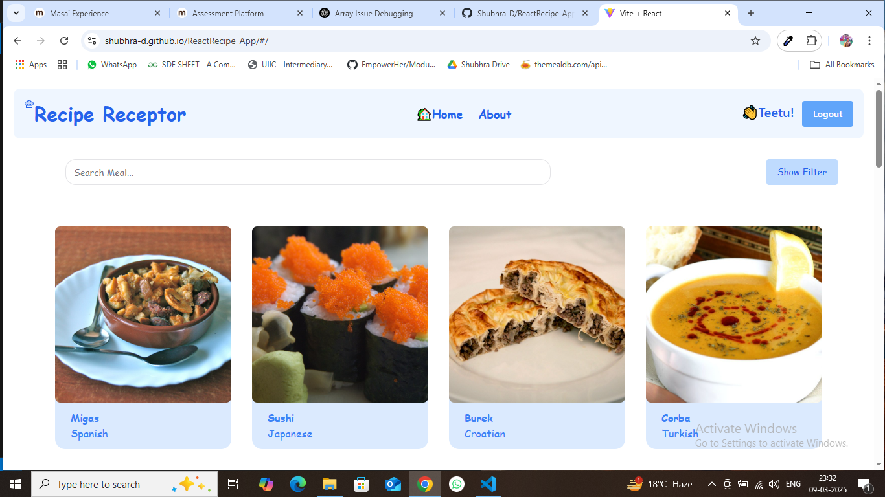
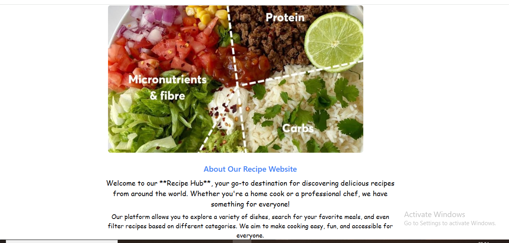
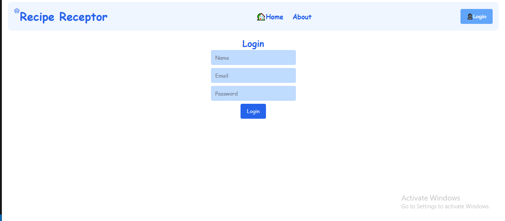
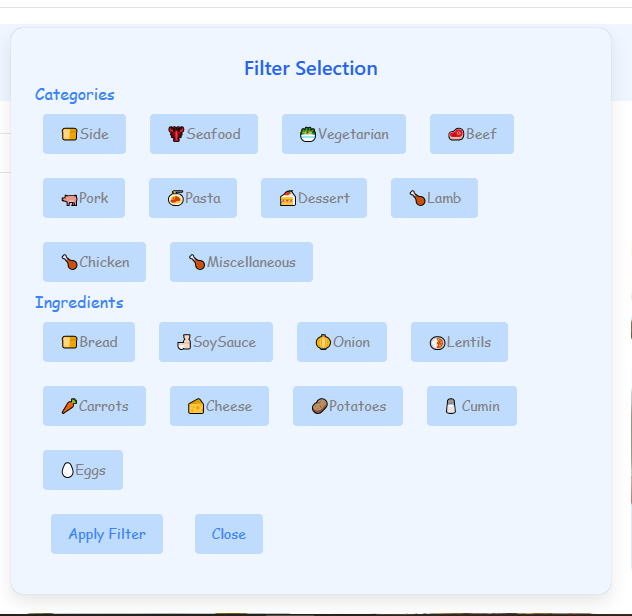

# React + Vite

#### Find the Live Url
[GithubDeployedLink](https://shubhra-d.github.io/ReactRecipe_App/)

## Home Page
* Here all the recipes are being Shown user can see all the recipes and their details without loggin in.
 

## About Page
* This page gives a brief introduction of the website and is purely static.

## Recipe Details Page
* In this page individual recipe is shown with it's ingredients and cooking process

## Login page
* This page logs in the user and updates the Navbar with it's name and logout button.

## Filter Box
* This is not a separate page but a filter box where user can view some dishes of choice by adding some filters.

